<div align="center">



</div>

<div align="center">

[](https://www.linkedin.com/in/elia-dallanoce-b5a9512a5/)
[](mailto:eliadallanoce@gmail.com)
[](#)

</div>

---

## About

Graduated in **Computer Engineering**. I work on software as the intersection between scientific method and creative vision — turning complex problems into elegant, well-engineered solutions.

```java
class Engineer {
    String degree = "Computer Engineering";
    String focus  = "Problem Solving";

    boolean isCreative() { return true; }
}
```

**Currently** → deepening systems programming in Rust and modern web architectures.
**Interested in** → data science, distributed systems, developer tooling, interface design.
**Open to** → collaborations, open-source contributions, engineering roles.

---

## Stack

| | |
|:--|:--|
| **Languages** |      |
| **Web** |      |
| **Frameworks** |      |
| **Data** |      |
| **Infra & Tools** |       |

---

## Selected Work

<!-- Sostituisci repo=... con i nomi reali dei tuoi repository -->
<div align="center">

<a href="https://github.com/eliaxyzz">
  
</a>
<a href="https://github.com/eliaxyzz">
  
</a>

</div>

---

## Stats

<div align="center">


<br/>


</div>

---

<div align="center">



</div>
